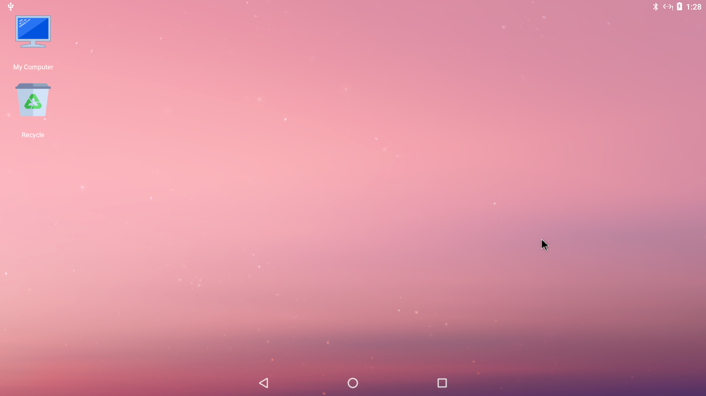
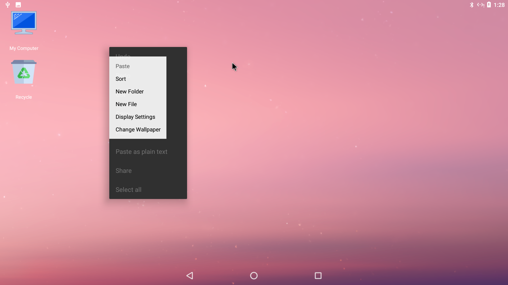
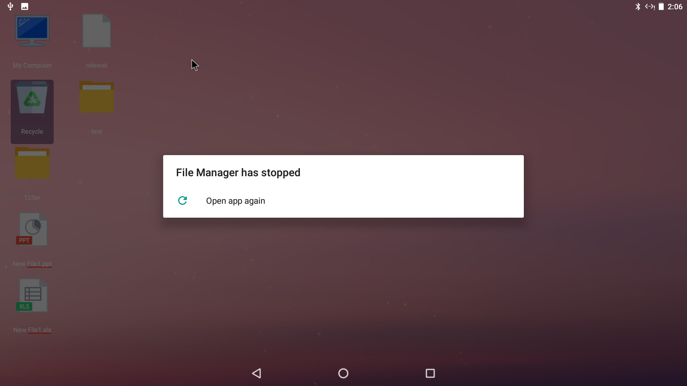
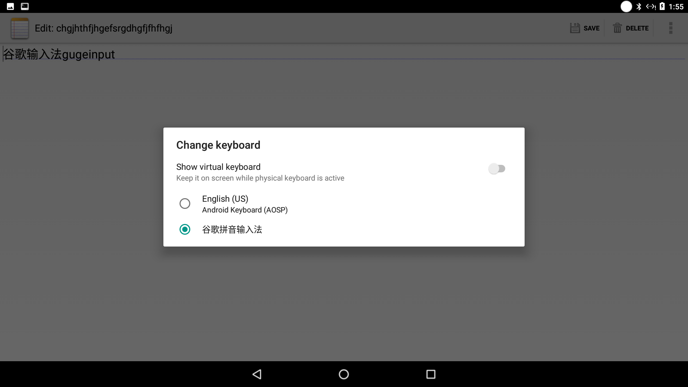
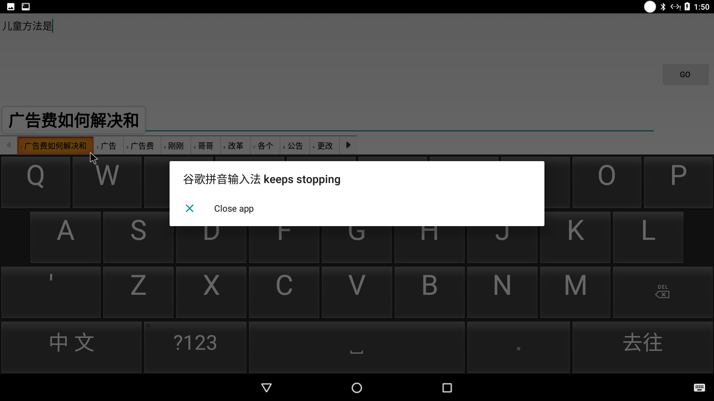
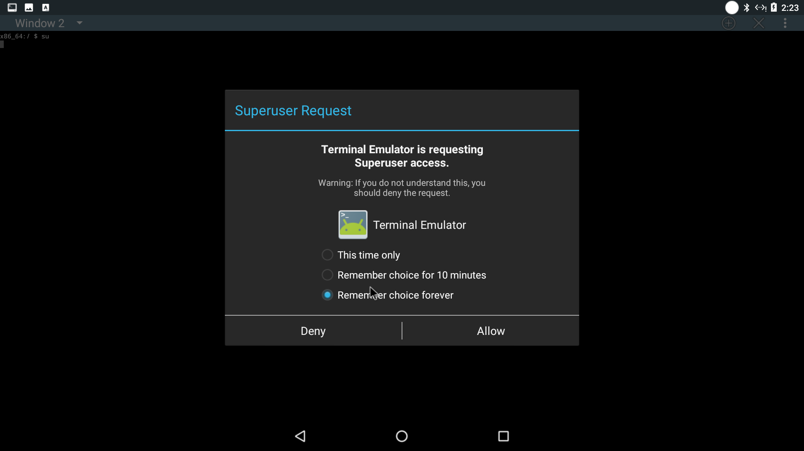
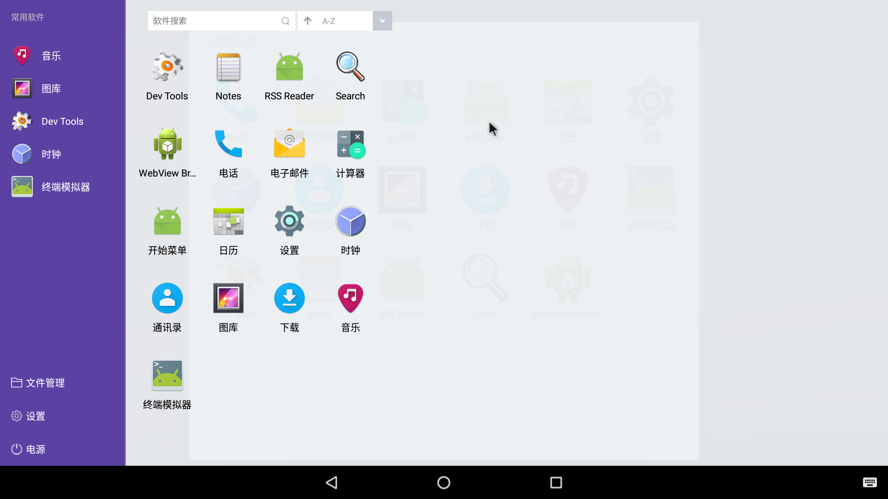
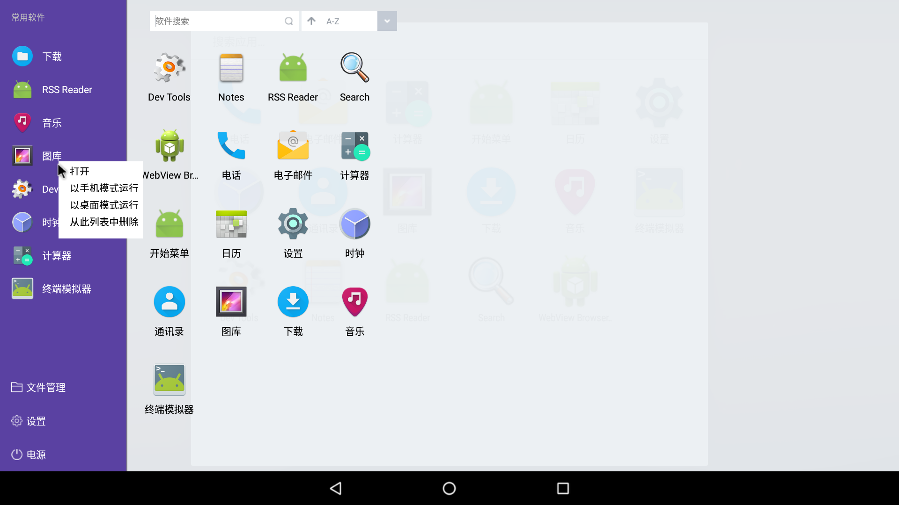

# 7.1 ~laucher (桌面，FM)版本验证
### 桌面问题
1.  桌面下方原生三按钮未去除，通知栏及任务栏在顶端显示，如图laucher.png

2.  桌面点右键容易出现双右菜单如图rightbutton所示。（易复现）

3.  桌面-右键-change wallpaper时，弹“launcher3 has stoppted”。无法更换桌面背景-如图bj.png

### FM问题
1.  通过my computer,Recyle进入文件管理器，右键sort时，弹出框显示有问题，如图sort.png。-DPI问题

2.  FM-Auto Mount识别到的分区不可点击，点击FM即崩溃。如图fmcrash.png

3.  查看截图时-弹FM keeps stopping.如图piccrash.png

4.  左侧栏中Document写错了。目前写的“Docement”-请改正

5. 连接U盘时提示“usb device is connected”,但是不显示任何U盘设备。-进到mycomputer磁盘下找到了U盘设备。

# 7.1 ~输入法，终端 版本验证

### 输入法问题

1. 输入法需要激活：打开Settings -> Languages&input -> virtual keyboard -> Manage keyboards -> 谷歌拼音输入法，然后输入时点击右下角键盘切换为谷歌拼音输入法

2. 打开软键盘，可以输入，但是会提示谷歌输入法停止运行

### 终端测试问题

1. 每增加一个窗口使用su都需要重新获取用户权限

### 其他问题

1. 自动睡眠后不能唤醒，按电源键后，屏幕最暗且不能调节亮度，能看到poweroff和restart弹窗且横屏显示。

# 7.1 ~自研APP 版本验证

# 7.1 ~startmenu 版本验证

### 开始菜单问题

1. 开始菜单打开是全屏显示

2. 开始菜单使用流畅,目前未出现卡顿的情况
