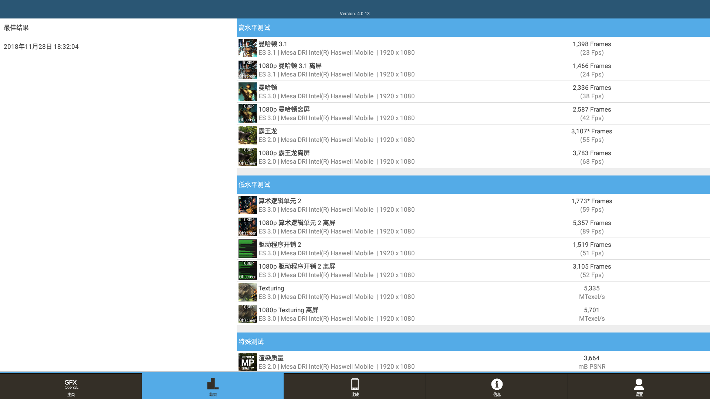

s6笔记本，u盘启动，通过菜单选择是否开启smt

||关smt|开smt|
|-----|-----|-----|
|pcmark|9609|10998|
|3dmark|3036|3713|
|gfxbench|||

***

清华同方t45笔记本，u盘启动，通过菜单选择是否开启smt

||关smt|开smt|
|-----|-----|-----|
|pcmark|7939|7606|
|3dmark|1855|2197|
|gfxbench|||

***

清华同方台式机精锐X500-B107，u盘启动，通过菜单选择是否开启smt

||关smt|开smt|
|-----|-----|-----|
|pcmark|6873||
|3dmark|4031 有异常亮点||
|gfxbench|||
