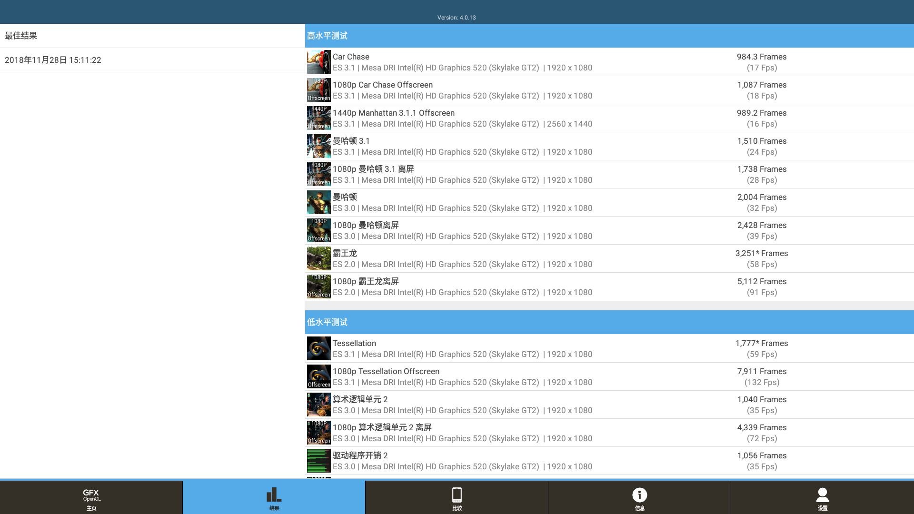

s6笔记本，u盘启动，通过菜单选择是否开启smt

||关smt|开smt|
|-----|-----|-----|
|pcmark|9609||
|3dmark|3036||
关smt:  

***

清华同方t45笔记本，u盘启动

||关smt|开smt|
|-----|-----|-----|
|pcmark|7678|7606|
|3dmark|1782|2197|

关smt:  
  

开smt:  

***

清华同方台式机精锐X500-B107，u盘启动

||关smt|开smt|
|-----|-----|-----|
|pcmark|6088||
|3dmark|4039||
