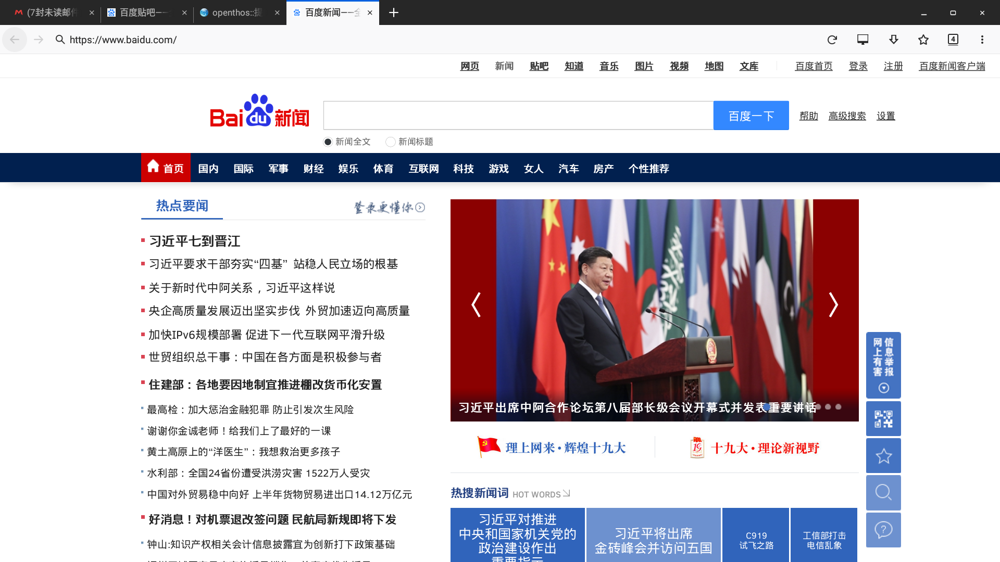

### 按严重程度排序
- 浏览器查看内容较多的邮件时，浏览器卡住，切换其他tab页后，全部白屏(比如王之旭6月28日18：51提交的patch邮件)
- 在微博、知乎之类视频较多的网站非常容易死机，配置普通一些的电脑随便开一个视频，浏览器的cpu占用率就上70％了
- 浏览器的部分输入框输入中文时会出现拼音字母直接打印出来的问题（github、码云等都有此问题），比如下图，实际上我只打了“搜索”的拼音sousuo

- 大部分视频网站的视频无法播放（html5格式的除外）
- 使用一段时间后会出现标签错乱问题

- ublock默认开启，此时百度图片中的绝大多数页面都无法直接显示，需要先关掉ublock才行，建议添加例外

- 浏览器有时页面上出现异常图案，如图

- 浏览器显示图片会出现异常色块闪烁

- 浏览器中如果点击了地址栏，之后无论切换到哪个网页，地址栏都只显示最开始的那一个网页，如图

- 点击浏览器下载列表中的apk文件，弹出打开方式的对话框，没有安装选项
- 菜单－页面－添加到主屏幕，点击后桌面图标会穿透出来闪一下，实际无效，建议取消此项目

