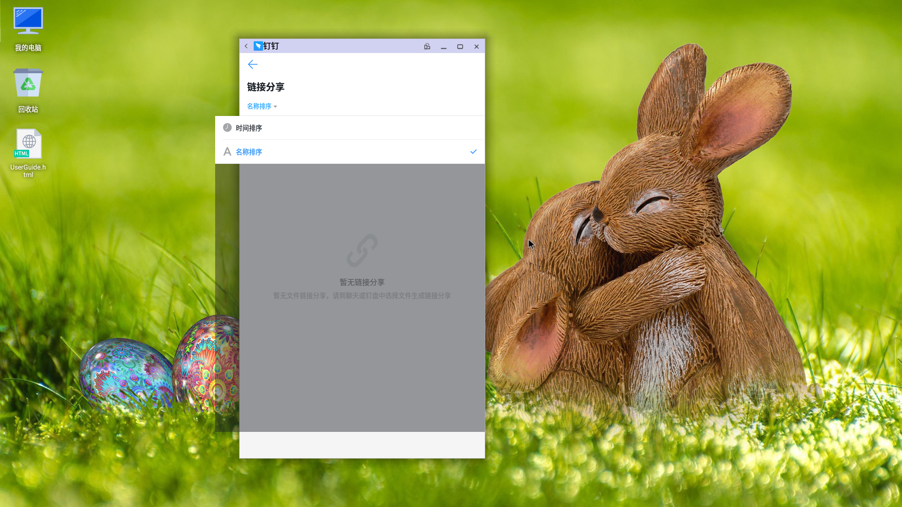
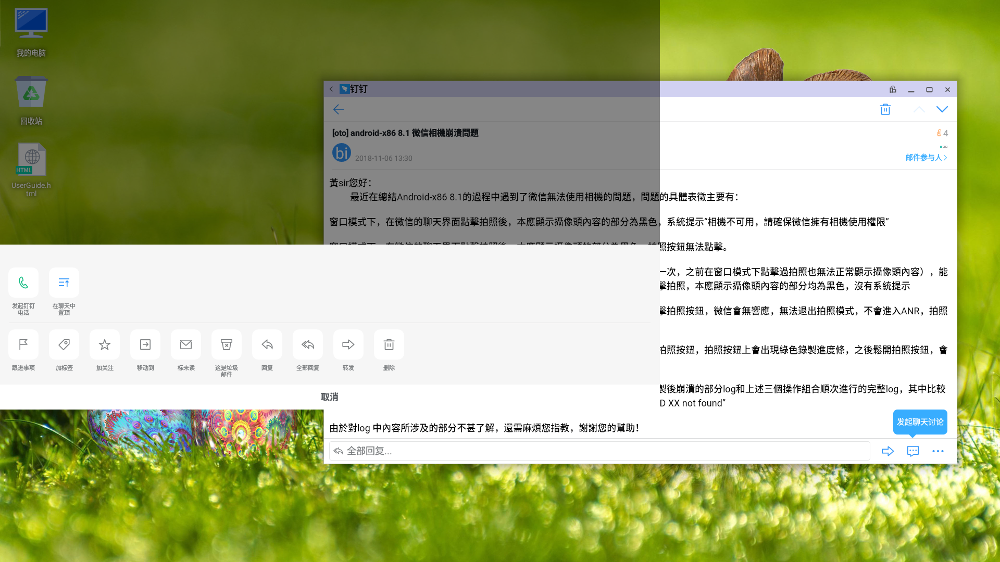
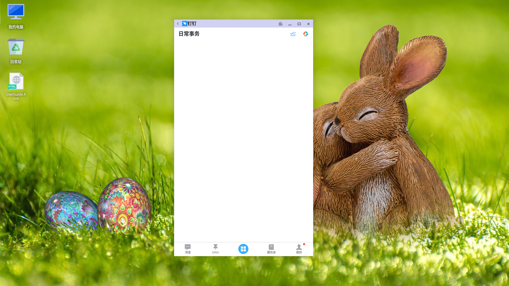

# 钉钉测试结果
## 20190320

- 版本号：V4.6.18

### 界面显示

- 消息、DING、工作、通讯录、我的：显示正常

### 聊天窗口

- 图片、文字、拍照、文件传输：正常

## 20181225

基本可以使用，有些功能刚打开时会有些卡顿，问题主要集中在多窗口部分：
- 1.钉盘无法上传文件。上传文件的选择框一闪而过，无法选中。
- 2.钉盘－链接分享，点击排序后菜单宽度超出窗口边界  

- 3.钉邮里，点击右下角的“...“标志，图像显示在窗口左上角。  

- 4.多次切换窗口或页面卡顿后，部分页面会显示空白  

- 5.我的／新校招，新窗口显示在原窗口左侧。  

- 6.部分电脑中钉邮里的邮件无法显示正文。
- 7.标题栏偶尔消失（较难复现）
- 8.刚开始使用时偶尔重启（较难复现）
