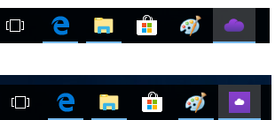

## windows
可以正常使用，未完成小图标的ui替换、未移除不需要的仓库
- 1. 初次启动时界面不在屏幕中心  

- 2. 点击“在线帮助”后会进入seafile的页面，且内容为page not found，是否要换为openthos的云服务帮助文档  

- 3. 任务栏图标：直接启动时的图标与固定到任务栏时的图标不一致  

- 4. 点击窗口右上角的x关闭程序后，状态栏的图标不消失，此时再通过exe文件打开会多出一个图标  

## linux
可以正常使用，未完成小图标的ui替换、未移除不需要的仓库
- 1. 初次启动时界面不在屏幕中心  
  
- 2. 点击窗口右上角的x关闭程序后，状态栏的图标不消失，此时再打开会多出一个图标 

## android
可以正常使用，手机版ui已替换，未完成桌面版布局
- 1. 登陆的时候服务器名称不应该是\*.openthos.**com**，而应该是\*.openthos.**org**
- 2. 登陆界面的“邮箱或用户名”应该指的是用户的**注册邮箱**或**注册的用户名**，而这两者均无法登陆。“用户名＠openthos.org" 这样的登陆名与网页端和电脑端的登陆方式不一致。
- 3. 登陆的时候如果输入错误的用户名和密码没有相应的错误提示。
