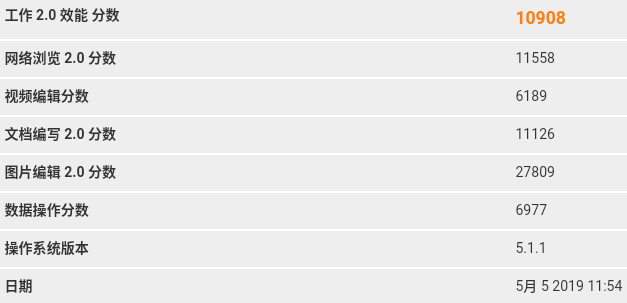
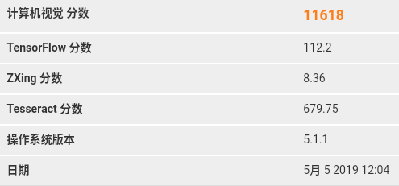
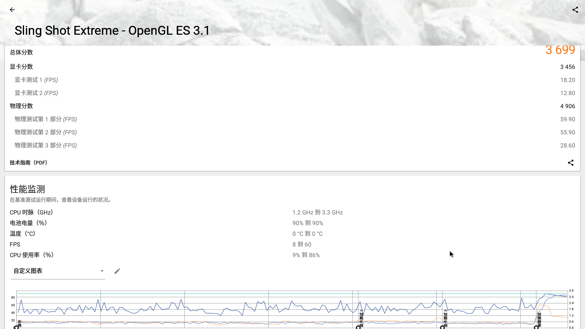
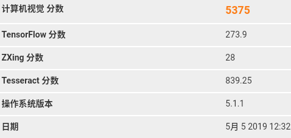
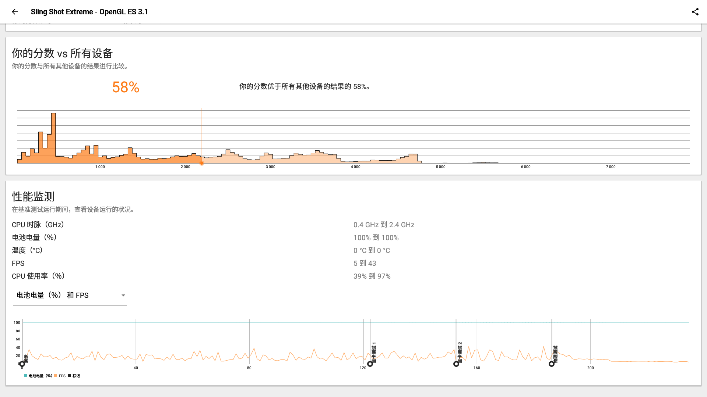

## benchmark测试结果

### 测试设备列表
 - https://github.com/openthos/app-testing-results/blob/master/list/%E6%B5%8B%E8%AF%95%E8%AE%BE%E5%A4%87%E5%88%97%E8%A1%A8.md
### 20190505
#### 1. 台式机 超越E500-63548
- 工作2.0
   - 总分：10908
   - 网络浏览：11558
   - 视频编辑：6189
   - 文档编写：11126
   - 图片编辑：27809
   - 数据操作：6977
   - 
- 计算机视觉
   - 总分：11618
   - TensorFlow：112.2
   - ZXing：8.36
   - Tesseract：679.75
   - 
- 存储
   - 总分：17224
   - 内部存储顺序读取949.81 MB/s
   - 内部存储随机读取：42.53 MB/s
   - 内部存储顺序写入：733.9 MB/s
   - 内部存储随机写入：15.5 MB/s
   - 外部存储顺序读取：374.8 MB/s
   - 外部存储随机读取：35.72 MB/s
   - 外部存储顺序写入：492.78 MB/s
   - 外部存储随机写入：15.59 MB/s
   - SQLite读取：11811 /OPS
   - SQLite更新：1000 /OPS
   - SQLite插入：666 /OPS
   - SQLite删除：1000 /OPS
   - 
- sling shot extreme
   - 总分：7746
   - 显卡分数：8690
   - 显卡测试1（FPS）：45.20
   - 显卡测试2（FPS）:32.40
   - 物理分数：5613
   - 物理测试第1部分（FPS）：60.00
   - 物理测试第2部分（FPS）：59.90
   - 物理测试第3部分（FPS）：34.70
   - 
   - 

#### 2. 笔记本 S6
- 工作2.0
   - 总分：11008
   - 网络浏览：11934
   - 视频编辑：6835
   - 文档编写：11684
   - 图片编辑：24287
   - 数据操作：6982
   - 
- 计算机视觉
   - 总分：11040
   - TensorFlow：94.9
   - ZXing：11.71
   - Tesseract：694.75
   - 
- 存储
   - 总分：4680
   - 内部存储顺序读取503.09 MB/s
   - 内部存储随机读取：32.75 MB/s
   - 内部存储顺序写入：134.13 MB/s
   - 内部存储随机写入：1.08 MB/s
   - 外部存储顺序读取：351.38 MB/s
   - 外部存储随机读取： 28.72 MB/s
   - 外部存储顺序写入：121.9 MB/s
   - 外部存储随机写入：1.05 MB/s
   - SQLite读取：11173 /OPS
   - SQLite更新：100 /OPS
   - SQLite插入：83 /OPS
   - SQLite删除：100 /OPS
   - 
- sling shot extreme
   - 总分：3699
   - 显卡分数：3456
   - 显卡测试1（FPS）：18.20
   - 显卡测试2（FPS）:12.80
   - 物理分数：4906
   - 物理测试第1部分（FPS）：59.90
   - 物理测试第2部分（FPS）：55.90
   - 物理测试第3部分（FPS）：28.60
   - 
   - 
#### 3. 笔记本 t45
- 工作2.0
   - 
- 计算机视觉
   - 
- 存储
   - 
- sling shot extreme
   - 
   - 
