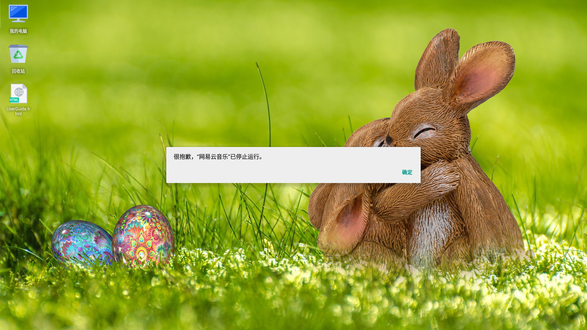

#### －，目的

ASOP kernel 4.19.5打上patch后可以正常运行GFXBench。本次测试的目的就是看其它程序和整个系统在kernel4.19.5内核上运行时的稳定性。

#### 二，结论

4.19.5打上patch的内核稳定性尚可，但有如下问题：一个应用无法运行(网易云音乐)，一个应用有错误提示但不影响使用(wps)，还有五个游戏无法运行。

#### 三，详细结果

##### 1.  网易云音乐和游戏“buttons and scissons”无法运行的错误提示。

   

##### 2. wps在退出的时候会有出错提示。

   

##### 3. 海滨消消乐和开心消消乐无法运行，提示”不支持在模拟器上运行“

   

##### 4. Angry Birds Star Wars右下角始终是0％，无法下载资源。

   

##### 5. 狂野飙车8无法运行的错误提示。

   