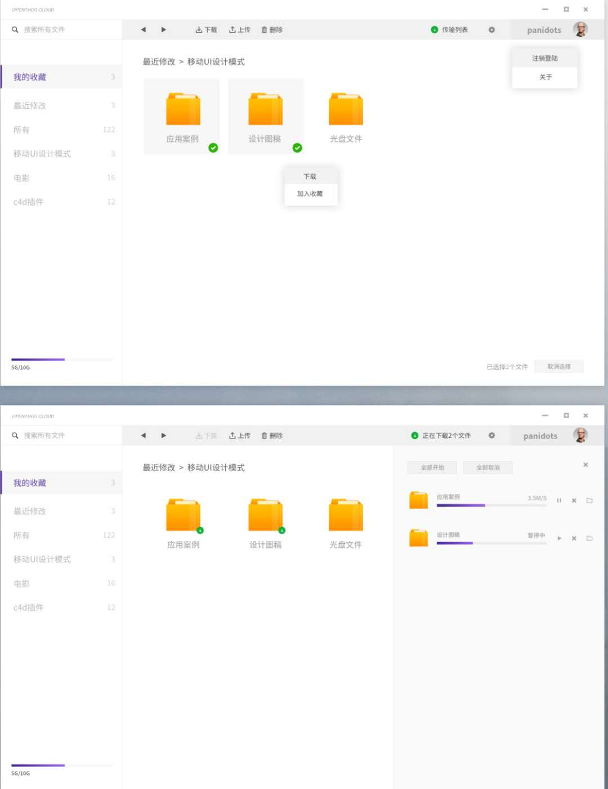

# OPENTHOS云安卓端未完成项目列表
### 对比列表

项目名称|刘总和UX的需求|当前情况
-----|-----|-----
UI显示&nbsp; &nbsp; &nbsp; &nbsp; &nbsp; &nbsp; &nbsp; &nbsp; &nbsp; &nbsp; &nbsp; &nbsp; &nbsp; &nbsp; &nbsp;&nbsp; &nbsp; &nbsp; &nbsp; &nbsp; &nbsp;|需求如图  |部分界面需对接ui，包括上方工具栏、上方当前目录位置、右边文件传输进度、左下角可用容量、登录界面、以及其它细节    
底栏的四个功能|四个按钮 **文件 最近 传输 我的**|目前没有按钮
选择服务器|去掉选择服务器|未去掉
忘记密码|增加忘记密码|未增加

### 其它问题
   - cloud服务器无法上传下载文件，可能和ssl证书验证失败有关，dev服务器的正常
