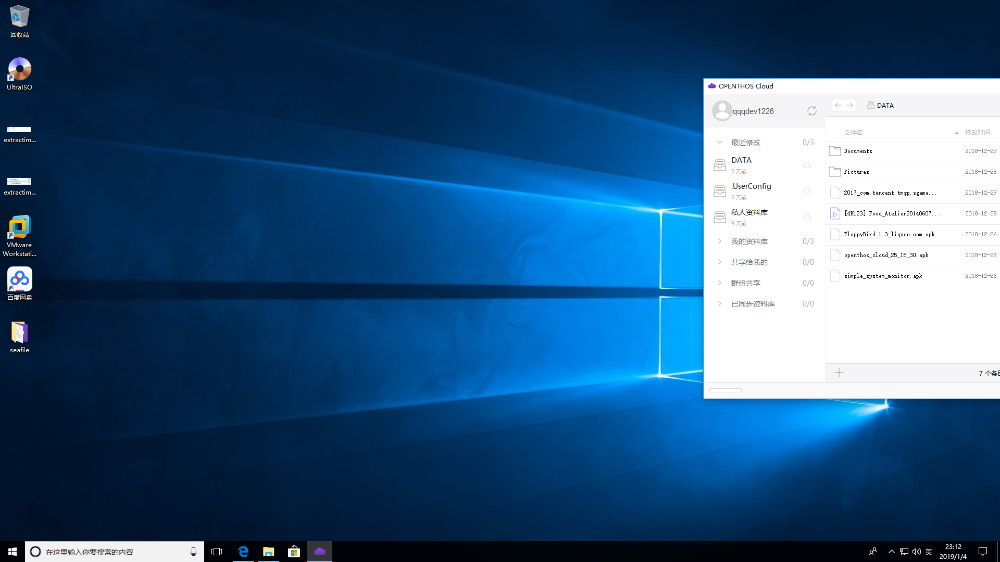
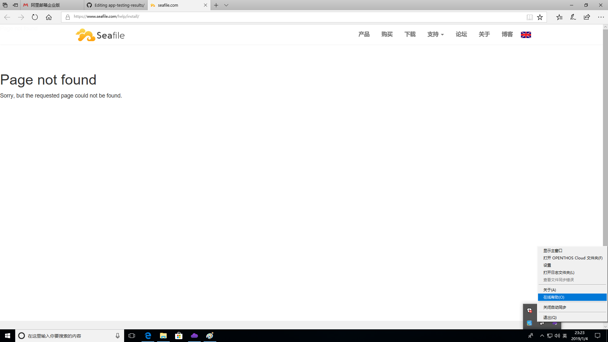
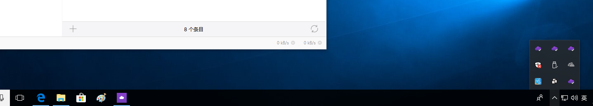

## windows
- 1. 初次启动时界面不在屏幕中心  

- 2. 界面UI未替换
- 3. 点击“在线帮助”后会进入seafile的页面，且内容为page not found，是否要换为openthos的云服务帮助文档  

- 4. 任务栏图标：直接启动时的图标与固定到任务栏时的图标不一致  

- 5. 点击窗口右上角的x关闭程序后，状态栏的图标不消失，此时再通过exe文件打开会多出一个图标  

- 6. 共享功能隐藏
- 7. 左右分栏联动现在需要双击，应改成左边库激活（单击或者按tab切换焦点）就切换右侧查看器
- 8. 现在窗体改大小的时候，左右分栏和其他UI组件跟随缩放的策略有点问题
- 9. 左侧窗体内容重复，只有一组“我的资料库“就可以了，并按照更新时间排序,其他的“最近修改”和“已同步”没有意义
- 10. 对应左侧窗体资料库的右键菜单去掉“打开云端文件浏览器”

## linux
- 1. 可以正常上传下载，界面ui未替换  
  

